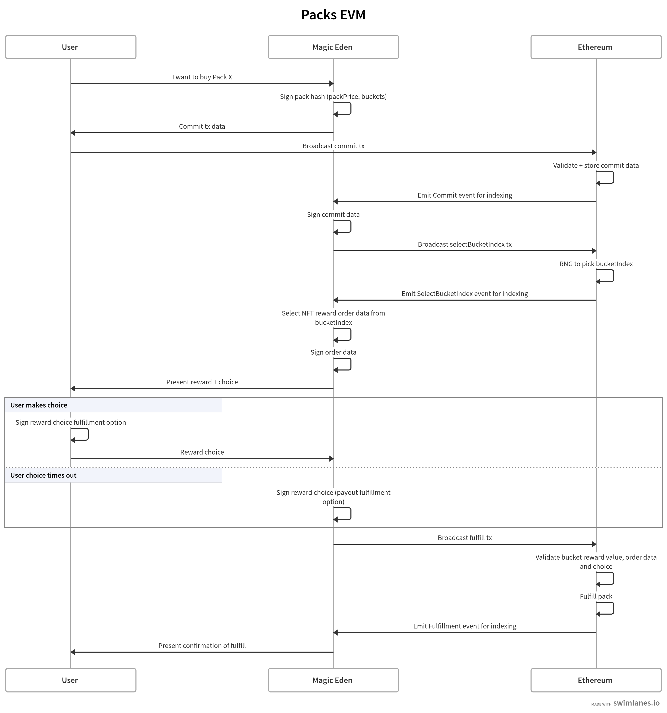

# Packs EVM Contracts

Packs is a suite of EVM smart contracts that serve the Magic Eden NFT packs purchasing product. A user can commit to purchase a pack (for a fixed price) with a pre-determined number of bucketed outcomes; each bucket having it's own reward range and odds of being won. Using RNG, the user is presented with an NFT with a value within the bucket range selected. The user can select whether to take ownership of the NFT (purchased on their behalf) or recieve it's value (minus the payout option fee). Every pack play results in a reward.

## Deployments

## Overview

1. User commits to purchase a pack with a fixed price, bucket reward range and odds
   1. Trusted cosigner verifies pack data on commit
2. Result of the pack purchase is shown to the user
   1. RNG is simulated off-chain
3. User chooses the NFT or its value and Packs fulfills the play
   1. RNG is verified on-chain
   2. Trusted cosigner verifies NFT order data
   3. User choice is verified

Packs is similar to LuckyBuy, with the key differences being:

- Order data can not be known in advance (because bucket value range is static, while NFT prices are dynamic)
- RNG result is presented pre-fulfill and verified on fulfill (safe because the seed is deterministic post-commit)
- Users' have the ability to make a choice from two fulfillment options (take NFT or take cash value reward)

## Deployment

Packs uses the [ERC1967](https://docs.openzeppelin.com/contracts/5.x/api/proxy#ERC1967Proxy) proxy implementation pattern, meaning the contract is upgradeable.

Example depoyment script for Ethereum Sepolia testnet:

`forge script ./script/DeployPacks.s.sol:DeployPacks --chain-id 11155111 --rpc-url https://sepolia.drpc.org --verify --broadcast`
